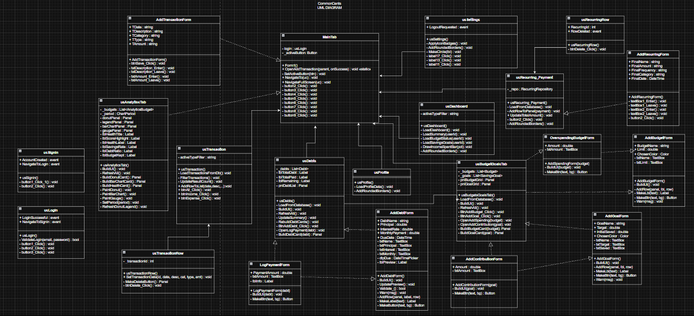

<p align="center">
  
</p>

<h1 align="center"> 💰 CommonCents 💰 </h1>


<h3 align="center"> A personal finance management desktop application </h3>

<p align="center">
<b> AOOP Project </b><br/>
Buenavista, Christian Paolo M. <br/>
Talagtag, Karl Andrei C. <br/>
Manalo, Cris Julian <br/>
</p>

---

## 🔥 Overview

**CommonCents** is a Windows Forms desktop application built in **C# (.NET)** designed to help users manage their personal finances. It provides a clean, modern dark-themed UI for tracking income and expenses, managing budgets, monitoring savings goals, handling debts, and viewing recurring payments — all backed by a **SQL Server LocalDB** database.

This project demonstrates the practical use of **Object-Oriented Programming (OOP)** principles such as encapsulation, inheritance, abstraction, and polymorphism. It also follows the **Repository Pattern** for clean separation between the UI and data access layers.

### 👤 Users can:
💸 Track income and expenses with categorized transactions <br/>
📊 View analytics with bar charts, donut charts, and a health score gauge <br/>
🗂️ Set and manage monthly budget categories <br/>
🎯 Create and track savings goals with contribution history <br/>
💳 Monitor debts and log payments <br/>
🔁 Manage recurring payments (subscriptions, bills, etc.) <br/>
👤 View and update their profile information <br/>
🔐 Log in and sign up securely with account validation <br/>

---

## 🏗️ OOP Concepts Applied

### 🌀 Abstraction

The application separates **what a class does** from **how it does it** through clean interfaces and repository classes.

- `Budget`, `Debt`, `SavingsGoal`, `RecurringPayment`, and `TransactionRecord` are pure data models — they only expose what is needed.
- `BudgetRepository`, `DebtRepository`, `TransactionRepository`, `DashboardRepository`, `AnalyticsRepository`, and `RecurringRepository` abstract away all database operations from the UI.
- UI classes like `usBudgetsGoalsTab` and `usDebts` only call repository methods — they never write raw SQL.

---

### 💊 Encapsulation

Data is kept safe within classes through **private fields** and **controlled access via properties**.

For example, in `Budget`:
```csharp
public int    BudgetId      { get; set; }
public string Name          { get; set; }
public double Limit         { get; set; }
public double Spent         { get; set; }

public double Remaining       => Math.Max(0, Limit - Spent);
public double ProgressPercent => Limit > 0 ? Math.Min(100, (Spent / Limit) * 100) : 0;
```

- `Remaining` and `ProgressPercent` are computed and read-only — the outside world cannot accidentally set them.
- In `ModernProgressBar`, private backing fields `_value`, `_maximum`, `_progressColor`, and `_trackColor` are only exposed through validated public properties.
- `DatabaseHelper` hides its `ConnectionString` as a private field and only exposes `GetConnection()` and `TestConnection()`.

---

### 🧬 Inheritance

The project uses **C# WinForms inheritance** throughout:

- All dialog forms (`AddBudgetForm`, `AddGoalForm`, `AddDebtForm`, `AddTransactionForm`, `AddContributionForm`, `AddSpendingForm`, `LogPaymentForm`, `AddRecurringForm`) extend `Form`.
- All screen panels (`usDashboard`, `usTransaction`, `usAnalyticsTab`, `usBudgetsGoalsTab`, `usDebts`, `usRecurring_Payment`, `usProfile`, `usLogin`, `usSignin`, `usSettings`, `usTransactionRow`, `usRecurringRow`) extend `UserControl`.
- `ModernProgressBar` extends `Control` to create a fully custom-drawn rounded progress bar.
- `Form1` (MainTab) extends `Form` and acts as the main shell that hosts all UserControls.

This hierarchy ensures:
1. **Code Reuse** — All forms share built-in Form behavior (dialog results, closing, sizing).
2. **Enforced Structure** — All UserControls share the WinForms rendering pipeline.
3. **Extensibility** — New screens can be added simply by creating a new UserControl.

---

### ✨ Polymorphism

The application uses **runtime polymorphism** through events and delegates:

- `usLogin` exposes `LoginSuccessful` and `NavigateToSignin` events. `Program.cs` subscribes to these at runtime — the exact behavior is determined dynamically.
- `usSignin` exposes `AccountCreated` and `NavigateToLogin` events, wired up in `Program.cs`.
- `usSettings` exposes a `LogoutRequested` event. `Form1` subscribes and handles it at runtime.
- `usRecurringRow` exposes a `RowDeleted` event — `usRecurring_Payment` subscribes to it for each row, allowing each row to trigger different cleanup behavior.
- `Form1.OpenAddTransaction()` accepts an `Action onSuccess` delegate — different callers (`usDashboard`, `usTransaction`, `usProfile`) pass different callback methods, so the same method produces different results at runtime.

---

## 𝄜 UML Diagram

<p align="center">
  
</p>

## 📁 Project Structure

```
📂 CommonCents
├── 📂 MiniTabs/           ← Project resources and settings
│   ├── 📄 AddBudgetForm.cs
│   ├── 📄 AddBudgetForm.resx
│   ├── 📄 AddContributionForm.cs
│   ├── 📄 AddContributionForm.resx
│   ├── 📄 AddDebtForm.cs
│   ├── 📄 AddDebtForm.resx
│   ├── 📄 AddGoalForm.cs
│   ├── 📄 AddGoalForm.resx
│   ├── 📄 AddRecurringForm.Designer.cs
│   ├── 📄 AddRecurringForm.cs
│   ├── 📄 AddRecurringForm.resx
│   ├── 📄 AddTransactionForm.Designer.cs
│   ├── 📄 AddTransactionForm.cs
│   ├── 📄 AddTransactionForm.resx
│   ├── 📄 LogPaymentForm.cs
│   ├── 📄 LogPaymentForm.resx
│   ├── 📄 OverspendingBudgetForm.cs
│   ├── 📄 OverspendingBudgetForm.resx
│   ├── 📄 usRecurringRow.Designer.cs
│   ├── 📄 usRecurringRow.cs
│   ├── 📄 usRecurringRow.resx
│   ├── 📄 usTransactionRow.Designer.cs
│   ├── 📄 usTransactionRow.cs
│   ├── 📄 usTransactionRow.resx
├── 📂 Properties/           ← Project resources and settings
│   ├── 📄 Resources.Designer.cs
│   ├── 📄 Resources.resx
├── 📂 Repositories/           ← Database access layer
│   └── 📄 AnalyticsRepository.cs
│   ├── 📄 BudgetRepository.cs
│   ├── 📄 DashboardRepository.cs
│   ├── 📄 DebtRepository.cs
│   ├── 📄 RecurringRepository.cs
│   ├── 📄 TransactionRepository.cs
├── 📂 Resources/         ← Models, utilities, and helper files
│   ├── 📄 backgroundremover-removebg-preview.png
├── 📂 SupportClasses/         ← Application assets and helper resources
│   ├── 📄 Budget.cs
│   ├── 📄 ChartPeriod.cs
│   ├── 📄 DatabaseHelper.cs
│   ├── 📄 Debt.cs
│   ├── 📄 GraphicsExtensions.cs
│   ├── 📄 ModernProgressBar.cs
│   ├── 📄 Program.cs
│   ├── 📄 RecurringPayment.cs
│   ├── 📄 SavingsGoals.cs
│   ├── 📄 SessionManager.cs
│   └── 📄 UIHelper.cs
├── 📂 Tabs/                   ← Main screen UserControls
│   ├── 📄 MainTab.Designer.cs
│   ├── 📄 MainTab.cs              ← Form1 (main shell)
│   ├── 📄 MainTab.resx
│   ├── 📄 usAnalyticsTab.cs
│   ├── 📄 usAnalyticsTab.resx
│   ├── 📄 usBudgetsGoalsTab.cs
│   ├── 📄 usBudgetsGoalsTab.resx
│   ├── 📄 usDashboard.Designer.cs
│   ├── 📄 usDashboard.cs
│   ├── 📄 usDashboard.resx
│   ├── 📄 usDebts.cs
│   ├── 📄 usDebts.resx
│   ├── 📄 usLogin.Designer.cs
│   ├── 📄 usLogin.cs
│   ├── 📄 usLogin.resx
│   ├── 📄 usProfile.Designer.cs
│   ├── 📄 usProfile.cs
│   ├── 📄 usProfile.dje-NE.resx
│   ├── 📄 usProfile.dje.resx
│   ├── 📄 usProfile.resx
│   ├── 📄 usRecurring_Payment.Designer.cs
│   ├── 📄 usRecurring_Payment.cs
│   ├── 📄 usRecurring_Payment.resx
│   ├── 📄 usSettings.Designer.cs
│   ├── 📄 usSettings.cs
│   ├── 📄 usSettings.resx
│   ├── 📄 usSignin.Designer.cs
│   ├── 📄 usSignin.cs
│   ├── 📄 usSignin.resx
│   ├── 📄 usTransaction.Designer.cs
│   ├── 📄 usTransaction.cs
│   └── 📄 usTransaction.resx
```

---

## ⚙️ Prerequisites

Before running the project, make sure you have:

- **Visual Studio 2022** (or later)
- **.NET 6.0** or higher
- **SQL Server LocalDB** (`(localdb)\MSSQLLocalDB`)
- **Microsoft.Data.SqlClient** NuGet package

---

## 🚀 How to Run

1. **Clone the repository:**
   ```bash
   git clone https://github.com/your-repo/CommonCents.git
   ```

2. **Open the solution in Visual Studio:**
   ```bash
   cd CommonCents
   start AOOP_PROJECTT.sln
   ```

3. **Set up the database:**
   - Open **SQL Server Object Explorer** in Visual Studio
   - Right-click `(localdb)\MSSQLLocalDB` then choosethe Publish Data-tier Appliction
   - Select the given .dacpac in the github.
   - Set database name to AOOP_DB
   - Click Publish

4. **Restore NuGet packages:**
   ```bash
   dotnet restore
   ```

5. **Build and run:**
   - Press `F5` in Visual Studio, or:
   ```bash
   dotnet run
   ```

---

## 🖥️ Key Features

| Feature | Description |
|---|---|
| 🔐 Login / Sign Up | Secure authentication stored in SQL Server |
| 📊 Dashboard | Balance overview, budget status, savings progress |
| 💸 Transactions | Add, view, filter, and delete income/expense records |
| 🗂️ Budgets & Goals | Set monthly budgets and track savings goals |
| 💳 Debts | Track debts, log payments, view progress |
| 🔁 Recurring Payments | Manage subscriptions and bills |
| 📈 Analytics | Bar charts, donut charts, and financial health score |
| 👤 Profile | View account info and financial statistics |
| ⚙️ Settings | Export data, clear data, logout |

---

## 👉 Contributors 👈

<table>
<tr>
    <th> &nbsp; </th>
    <th> Name </th>
    <th> Role </th>
    <th> Github Link </th>
</tr>
<tr>
    <td>👤</td>
    <td><strong>Christian Paolo M. Buenavista</strong></td>
    <td>Data Manager & UI/UX Developer</td>
    <td>https://github.com/ahmya19</td>

</tr>
<tr>
    <td>👤</td>
    <td><strong>Cris Julian V. Manalo</strong></td>
    <td>Project Leader - Database Manager & UI/UX Developer</td>
    <td>https://github.com/CrisJulian
    </td>
</tr>
<tr>
    <td>👤</td>
    <td><strong>Karl Andrei C. Talagtag</strong></td>
    <td>Main UI/UX Developer & Debugger</td>
    <td>https://github.com/DreiwanabeTexh</td>

</tr>

</table>

---

<h2 align="center"> 🙏 Acknowledgements 🙏 </h2>

<div align="center">

First and foremost, we give our heartfelt thanks to God for His guidance, strength, and blessings throughout the completion of this project.

We would like to express our sincere gratitude to our professor, Ms. Fatima Marie P. Agdon, for her guidance, support, and encouragement throughout the development of this project. Her insights and dedication greatly contributed to the completion and success of our work.

We would also like to extend our heartfelt thanks to our families and loved ones for their unwavering support, understanding, and encouragement throughout this journey. Their motivation and belief in us helped make this project possible.

💰 ──────────────────────────────────────────── 💰

We also thank each team member for their collaboration, hard work, and commitment throughout this project.

<em>"Take care of your cents, and the dollars will take care of themselves."</em>

</div>
